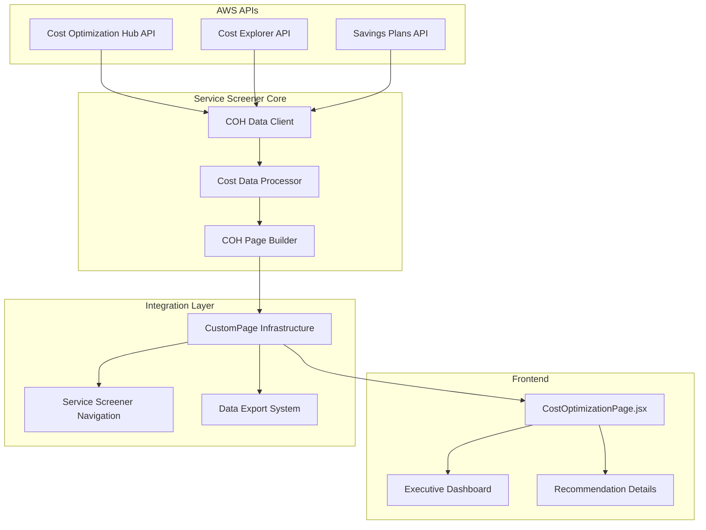
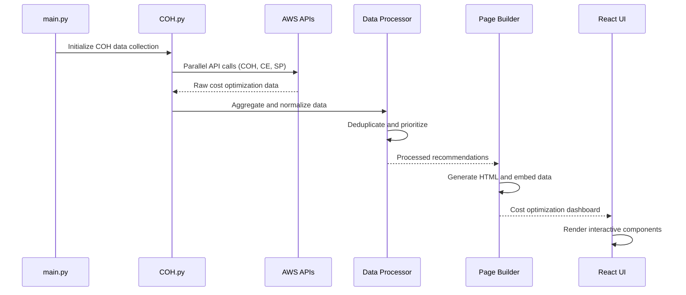

# Cost Optimization Hub Design Document

## Overview

The Cost Optimization Hub (COH) is a comprehensive custom page that aggregates cost-saving recommendations from three AWS cost optimization services: Cost Optimization Hub API, Cost Explorer API, and Savings Plans API. The system will provide a unified dashboard for cost optimization opportunities, intelligent recommendation prioritization, and seamless integration with the existing Service Screener infrastructure.

The COH will serve as a centralized cost intelligence platform, transforming raw cost optimization data from multiple AWS sources into actionable insights with clear implementation guidance and measurable business impact.

## Architecture

### High-Level Architecture



### Data Flow Architecture



## Components and Interfaces

### 1. COH Data Client (COH.py)

**Purpose**: Collect and normalize data from three AWS cost optimization APIs

**Key Classes**:
- `CostOptimizationHubClient`: Interface to Cost Optimization Hub API
- `CostExplorerClient`: Interface to Cost Explorer API  
- `SavingsPlansClient`: Interface to Savings Plans API
- `COHDataCollector`: Orchestrates data collection from all sources

**Key Methods**:
```python
class COHDataCollector:
    def collect_all_recommendations(self, regions: List[str]) -> Dict
    def get_coh_recommendations(self) -> List[Dict]
    def get_cost_explorer_recommendations(self) -> List[Dict]
    def get_savings_plans_recommendations(self) -> List[Dict]
    def normalize_recommendations(self, raw_data: Dict) -> List[CostRecommendation]
```

### 2. Cost Data Processor

**Purpose**: Process, deduplicate, and prioritize cost optimization recommendations

**Key Classes**:
- `CostRecommendation`: Unified data model for all recommendation types
- `RecommendationProcessor`: Core processing logic
- `PriorityCalculator`: Calculates recommendation priority scores
- `SavingsCalculator`: Standardizes savings calculations

**Key Methods**:
```python
class RecommendationProcessor:
    def deduplicate_recommendations(self, recommendations: List) -> List
    def calculate_priority_scores(self, recommendations: List) -> List
    def categorize_by_service(self, recommendations: List) -> Dict
    def generate_executive_summary(self, recommendations: List) -> Dict
```

### 3. COH Page Builder (COHPageBuilder.py)

**Purpose**: Generate HTML page and embed cost optimization data

**Key Classes**:
- `COHPageBuilder`: Main page generation logic
- `COHTemplateRenderer`: HTML template rendering
- `COHDataEmbedder`: Embed processed data into HTML

**Key Methods**:
```python
class COHPageBuilder:
    def build_coh_page(self, recommendations: List, output_dir: str) -> str
    def render_executive_dashboard(self, summary: Dict) -> str
    def render_recommendation_tables(self, recommendations: List) -> str
    def embed_cost_data(self, html_content: str, data: Dict) -> str
```

### 4. React UI Component (CostOptimizationPage.jsx)

**Purpose**: Interactive frontend for cost optimization dashboard

**Key Components**:
- `CostOptimizationPage`: Main page component
- `ExecutiveDashboard`: High-level metrics and KPIs
- `RecommendationTable`: Sortable, filterable recommendation list
- `RecommendationDetails`: Detailed view with implementation guidance
- `SavingsChart`: Visualization of savings potential and trends

## Data Models

### Core Data Model

```python
@dataclass
class CostRecommendation:
    id: str
    source: str  # 'coh', 'cost_explorer', 'savings_plans'
    category: str  # 'compute', 'storage', 'database', etc.
    service: str  # 'ec2', 's3', 'rds', etc.
    title: str
    description: str
    
    # Financial Impact
    monthly_savings: float
    annual_savings: float
    confidence_level: str  # 'high', 'medium', 'low'
    
    # Implementation Details
    implementation_effort: str  # 'low', 'medium', 'high'
    implementation_steps: List[str]
    required_permissions: List[str]
    potential_risks: List[str]
    
    # Resource Information
    affected_resources: List[Dict]
    resource_count: int
    
    # Prioritization
    priority_score: float
    priority_level: str  # 'high', 'medium', 'low'
    
    # Metadata
    created_date: datetime
    last_updated: datetime
    status: str  # 'new', 'reviewed', 'implemented', 'dismissed'

@dataclass
class ExecutiveSummary:
    total_recommendations: int
    total_monthly_savings: float
    total_annual_savings: float
    high_priority_count: int
    medium_priority_count: int
    low_priority_count: int
    top_categories: List[Dict]
    implementation_roadmap: List[Dict]
```

### API Response Models

```python
@dataclass
class COHRecommendation:
    recommendation_id: str
    category: str
    estimated_monthly_savings: float
    implementation_effort: str
    affected_resource_count: int
    recommendation_lookback_period: int

@dataclass
class CostExplorerRecommendation:
    rightsizing_type: str
    current_instance: str
    recommended_instance: str
    estimated_monthly_savings: float
    utilization_metrics: Dict

@dataclass
class SavingsPlansRecommendation:
    savings_plans_type: str
    term_in_years: int
    payment_option: str
    estimated_monthly_savings: float
    hourly_commitment: float
```

## Correctness Properties

*A property is a characteristic or behavior that should hold true across all valid executions of a system-essentially, a formal statement about what the system should do. Properties serve as the bridge between human-readable specifications and machine-verifiable correctness guarantees.*

<function_calls>
<invoke name="prework">
<parameter name="featureName">cost-optimization-hub
#
## Property Reflection

After reviewing all identified properties, I've identified several areas where properties can be consolidated to eliminate redundancy:

**Consolidation Opportunities:**
- Properties 2.2, 2.3, and 2.5 all test that recommendation displays contain required information - these can be combined into a single comprehensive property
- Properties 3.2, 3.3, and 3.5 all test dashboard display completeness - these can be merged into one property
- Properties 7.1, 7.2, 7.3, 7.4, and 7.5 all test export functionality - these can be consolidated into fewer, more comprehensive properties
- Properties 8.1, 8.2, 8.3, 8.4, and 8.5 all test error handling - these can be combined into comprehensive error handling properties

**Final Property Set:**
After consolidation, we have 15 unique, non-redundant properties that provide comprehensive coverage without overlap.

### Correctness Properties

Property 1: Multi-source data aggregation
*For any* set of API responses from Cost Optimization Hub, Cost Explorer, and Savings Plans APIs, the dashboard should display aggregated data from all available sources
**Validates: Requirements 1.1**

Property 2: Recommendation categorization consistency
*For any* set of cost recommendations, they should be consistently categorized by AWS service type and optimization category according to predefined taxonomy
**Validates: Requirements 1.2**

Property 3: Intelligent deduplication
*For any* set of overlapping recommendations from multiple sources, the system should merge similar recommendations while preserving unique information from each source
**Validates: Requirements 1.3**

Property 4: Savings display completeness
*For any* cost recommendation, the display should include monthly savings, annual savings, and confidence level information
**Validates: Requirements 1.4**

Property 5: Recommendation detail completeness
*For any* cost recommendation, clicking it should display implementation steps, effort level, risks, affected resources, and required permissions when applicable
**Validates: Requirements 2.1, 2.2, 2.3, 2.5**

Property 6: RI and Savings Plans enhancement
*For any* recommendation involving Reserved Instances or Savings Plans, the display should include purchase links and commitment analysis
**Validates: Requirements 2.4**

Property 7: Executive dashboard aggregation accuracy
*For any* set of recommendations, the executive dashboard should correctly calculate total savings, recommendation counts by priority, and display trends when historical data exists
**Validates: Requirements 3.1, 3.2, 3.3, 3.5**

Property 8: Executive report generation
*For any* set of recommendations, the system should generate exportable executive summaries suitable for leadership presentations
**Validates: Requirements 3.4**

Property 9: Service Screener integration completeness
*For any* Service Screener navigation or report generation, COH should be included in navigation and optionally in reports with proper cross-referencing
**Validates: Requirements 4.1, 4.2, 4.3, 4.5**

Property 10: Combined export functionality
*For any* export request, the system should support combined security and cost optimization data in multiple formats
**Validates: Requirements 4.4, 7.1, 7.2, 7.3, 7.4, 7.5**

Property 11: Priority-based sorting and filtering
*For any* set of recommendations, they should be sortable by priority score and filterable by priority level, service type, and savings threshold
**Validates: Requirements 5.1, 5.4**

Property 12: Priority calculation consistency
*For any* recommendation, the priority score should incorporate savings amount, implementation complexity, and business risk with consistent visual indicators
**Validates: Requirements 5.2, 5.3**

Property 13: Optimal strategy selection
*For any* resource with multiple optimization strategies, the system should recommend the approach with highest total impact
**Validates: Requirements 5.5**

Property 14: Security and compliance integration
*For any* cost recommendation, those affecting security or compliance should be flagged, prioritized appropriately, and include impact assessments
**Validates: Requirements 6.1, 6.2, 6.3, 6.4, 6.5**

Property 15: Graceful error handling
*For any* API failure, rate limiting, or data quality issue, the system should handle errors gracefully with appropriate user notifications and fallback to cached data when available
**Validates: Requirements 8.1, 8.2, 8.3, 8.4, 8.5**

## Error Handling

### API Error Handling
- **Connection Failures**: Implement exponential backoff retry logic with circuit breaker pattern
- **Rate Limiting**: Intelligent request throttling with user notification of delays
- **Partial Failures**: Display available data with clear indicators of missing sources
- **Data Quality Issues**: Validate recommendations and flag potentially inaccurate data

### Data Processing Error Handling
- **Invalid Recommendations**: Skip malformed data with logging for investigation
- **Calculation Errors**: Provide fallback calculations and confidence indicators
- **Deduplication Conflicts**: Use configurable conflict resolution strategies
- **Missing Required Fields**: Use default values with appropriate warnings

### UI Error Handling
- **Loading States**: Progressive loading with skeleton screens for better UX
- **Empty States**: Meaningful empty state messages with actionable guidance
- **Export Failures**: Retry mechanisms with alternative format options
- **Navigation Errors**: Graceful fallbacks to main dashboard view

## Testing Strategy

### Dual Testing Approach

The Cost Optimization Hub will implement both unit testing and property-based testing to ensure comprehensive coverage and reliability.

**Unit Testing Requirements:**
- Unit tests will verify specific examples, edge cases, and integration points
- Focus on API client functionality, data processing logic, and UI component behavior
- Test specific scenarios like empty API responses, malformed data, and error conditions
- Validate integration between COH and existing Service Screener infrastructure

**Property-Based Testing Requirements:**
- Property-based tests will verify universal properties across all inputs using **Hypothesis** for Python components and **fast-check** for JavaScript/React components
- Each property-based test will run a minimum of 100 iterations to ensure thorough coverage
- Tests will be tagged with comments explicitly referencing correctness properties: **Feature: cost-optimization-hub, Property {number}: {property_text}**
- Each correctness property will be implemented by a single property-based test
- Smart generators will be created to produce realistic cost optimization data within valid input spaces

**Testing Framework Configuration:**
- Python: pytest with Hypothesis for property-based testing
- JavaScript/React: Jest with fast-check for property-based testing
- Integration: Selenium or Playwright for end-to-end testing
- Performance: Custom benchmarking for API response times and data processing

**Test Data Strategy:**
- Generate realistic AWS cost optimization scenarios
- Create representative API response fixtures from all three sources
- Use property-based generators for comprehensive input coverage
- Implement smart constraints to generate valid business scenarios

## Implementation Architecture

### File Structure
```
utils/CustomPage/Pages/COH/
├── COH.py                          # Main data collection and processing
├── COHPageBuilder.py               # HTML page generation
├── templates/
│   ├── coh_dashboard.html          # Executive dashboard template
│   ├── coh_recommendations.html    # Recommendations table template
│   └── coh_details.html           # Recommendation details template
└── tests/
    ├── test_coh_data_collection.py
    ├── test_coh_processing.py
    └── test_coh_properties.py

cloudscape-ui/src/components/
├── CostOptimizationPage.jsx        # Main React component
├── ExecutiveDashboard.jsx          # High-level metrics component
├── RecommendationTable.jsx         # Sortable recommendations table
├── RecommendationDetails.jsx       # Detailed recommendation view
├── SavingsChart.jsx               # Cost savings visualizations
└── __tests__/
    ├── CostOptimizationPage.test.js
    └── cost_optimization_properties.test.js
```

### Integration Points
- **CustomPage Infrastructure**: Register COH in existing routing system
- **Navigation**: Add COH to Service Screener main navigation
- **Data Pipeline**: Integrate COH data collection into main scanning workflow
- **Export System**: Extend existing export functionality for cost optimization data
- **Cross-References**: Link cost recommendations to security/compliance findings

### Performance Considerations
- **Parallel API Calls**: Concurrent data collection from all three cost APIs
- **Intelligent Caching**: Cache recommendations with configurable TTL
- **Incremental Updates**: Delta processing for large recommendation sets
- **Lazy Loading**: Progressive data loading for improved perceived performance
- **Data Pagination**: Handle large datasets with efficient pagination

### Security and Compliance
- **IAM Permissions**: Document required permissions for cost optimization APIs
- **Data Privacy**: Ensure cost data handling complies with organizational policies
- **Access Control**: Integrate with existing Service Screener authentication
- **Audit Logging**: Log all cost optimization data access and modifications